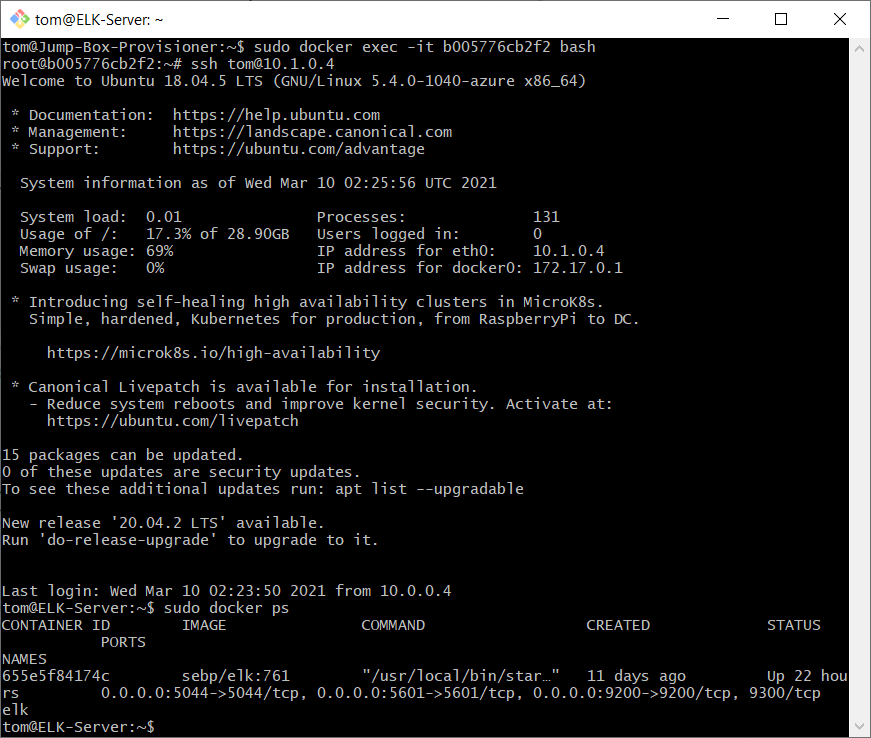
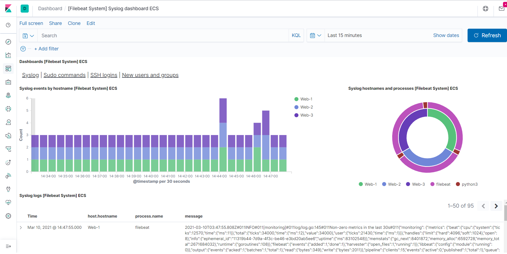

## Automated ELK Stack Deployment

The files in this repository were used to configure the network depicted below.

_Note: Access via Kibana and SSH is only available to my public IP address only._

These files have been tested and used to generate a live DVWA/ELK deployment on Azure. They can be used to either recreate the entire deployment pictured above. Alternatively, select portions of the playbook file may be used to install only certain pieces of it, such as FileBeat.

My playbooks are located [here](Ansible)

This document contains the following details:
- Description of the Network Topology
- Access Policies
- ELK Configuration
  - Beats in Use
  - Machines Being Monitored
- How to Use the Ansible Build

---

### Description of the Topology

The main purpose of this network is to expose a load-balanced and monitored instance of DVWA, the D*mn Vulnerable Web Application.

Load balancing ensures that our application will be highly available, in addition to restricting direct access to the network.

* Load balancers positively affect the availability of our servers, allowing many clients to make requests at the same time without overwhelming our network. If the traffic to one particular server becomes too great, the load balancer will divert all subsequent connections to a machine that isn't under heavy load. They are good at protecting against DDoS attacks for these reasons. Load balancers also provide an extra layer of security to our web servers by preventing direct access to them from the internet.
* A jump box provides an extra layer of security to our network by requring all incoming connections to pass through one single machine as an entry point. This makes it easier to observe incoming connections and monitor network traffic. SSH access to our web servers is only available from our jump box.

Integrating an ELK server allows users to easily monitor the vulnerable Virtual Machines for changes to the operating system and system files/services.
* Filebeat is a service that primarily monitors log files and forwards them to a location of your choosing, such as Elasticsearch or Logstash.
* Metricbeat records specific metrics from a computer's operating system (such as system info or system services) and sends them to a specified output, such as Elasticsearch or Logstash

Table 1. Configuration details of each Virtual Machine
| Name                  | Function      | IP Address   | Operating System     |
|-----------------------|---------------|--------------|----------------------|
| Jump-Box-Provisioner  | Gateway       | 10.0.0.4     | Linux (Ubuntu 18.04) |
| Web-1                 | Web server    | 10.0.0.7     | Linux (Ubuntu 18.04) |
| Web-2                 | Web server    | 10.0.0.8     | Linux (Ubuntu 18.04) |
| Web-3                 | Web server    | 10.0.0.9     | Linux (Ubuntu 18.04) |
| ELK-Server            | ELK stack     | 10.1.0.4     | Linux (Ubuntu 18.04) |

---

### Access Policies

The machines on the internal network are not exposed to the public Internet. 

Only the Jump Box machine can accept SSH connections from the Internet. Access to this machine is only allowed from xxx.186.180.111 (My public IP address)

Machines within the network can only be accessed via the jump box.
* My public IP has access to the ELK-Server via HTTP (port 5601) and the jump box has access to the ELK-Server via SSH (port 22).

Table 2. A summary of Virtual Machine access policies 
| Name                 | Publicly Accessible | Allowed IP Addresses |
|----------------------|---------------------|----------------------|
| Jump-Box-Provisioner | Yes (SSH)           | xxx.186.137.98       |
| Web-1                | No                  | 10.0.0.4             |
| Web-2                | No                  | 10.0.0.4             |
| Web-3                | No                  | 10.0.0.4             |
| ELK-Server           | Yes (HTTP)          | xxx.186.137.98       |

---

### Elk Configuration

Ansible was used to automate configuration of the ELK machine. No configuration was performed manually, which is advantageous due to some of the following reasons:
* It ensures machines across a network are configured in the exact the same way, this can be important when it comes to compatibility issues.
* It is efficient to setup and configure multiple machines at once, this saves many hours when considering the alternative method of configuring each machine manually, especially when there is a large number of them.
* Playbooks, once configured, can be reused as many times as needed, this makes it easier to roll-out complex configurations to large scale environments.
* Any errors/bugs found within the configuration can be edited in one single location, then the updates can be pushed out to entire networks at once.

The playbook implements the following tasks (which can be found [here](Ansible/install-elk.yml)):
1. Install Docker.io (used to manage containers)
2. Install pip3 (Python's package manager)
3. Install Docker Python module
4. Increase virtual memory - as the default allocated values are known to be too low.
5. Enable Docker service on boot

The following screenshot displays the result of running `docker ps` on the ELK-Server after successfully configuring the ELK instance via Ansible.

---

### Target Machines & Beats
The ELK server is setup to monitor Web-1, Web-2 and Web-3 (See Table 1 above for details) and FileBeat has been installed/configured on all of these machines.

FileBeat is setup to collect and send operating system log files collected from the three web servers. This information can be very valuable to an auditor/security-admin to monitor the environment for suspicious system traffic/info, such as unexpected changes to configuration files, repeated failed login attempts, and other suspicious account activity.

Below is a screenshot of the FileBeat dashboard.

---

### Using the Playbook
In order to use the playbook, you will need to have an Ansible control node already configured. Assuming you have such a control node provisioned: 

SSH into the control node and follow the steps below:
- Copy the playbook and configuration files to `/etc/ansible` in the Ansible Docker container located on your jumpbox (see all my files [here](Ansible)).
- Update the hosts file to include the private IP addresses of your web servers and ELK server, make sure they are assigned to the correct group (see [here](Ansible/hosts) for my hosts file, note un-commented lines 20-26)
- Update the configuration file located at `/etc/ansible/ansible.cfg` and set the remote_user option to your admin user that you setup SSH with. (see [here](Ansible/ansible.cfg) for my config file)

---

# To run the playbooks you must do the following:
1. SSH into your jumpbox: `ssh <admin-name>@<jump-box-IP>`
2. Start your Ansible Docker container: `sudo docker start <container>`
3. Attach your standard input, output and error streams to container: `sudo docker attach <container>`
4. Run your playbooks:
* `ansible-playbook /etc/ansible/pentest.yml`
* `ansible-playbook /etc/ansible/install-elk.yml`
* `ansible-playbook /etc/ansible/roles/filebeat-playbook.yml`

After running the playbooks, navigate to Kibana (`http://<ELK-Server-IP>:5601`) to ensure your ELK Server is running as expected, then navigate to one of your web servers (`http://<web-server-IP>/setup.php`) to ensure your DVWA is working as expected.
